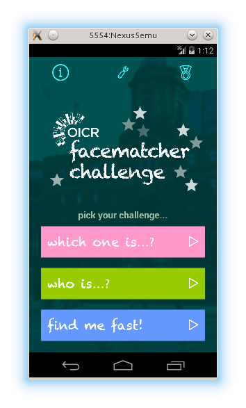
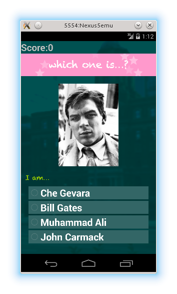
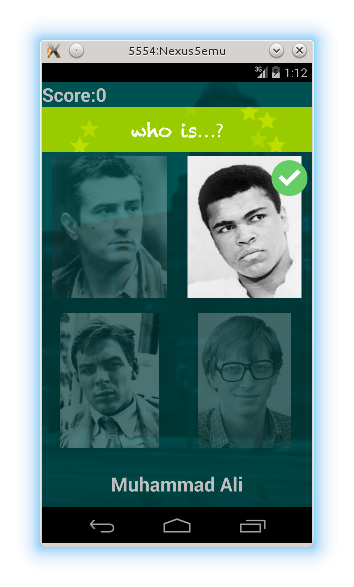
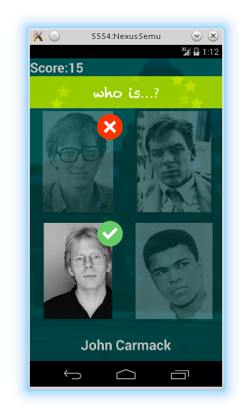

##FaceMatcher
A project for memory development - guess who are all these people and score! WIP, beta testing stage is nearing the completion. The app is supposed to be generic, all you need to have is a set of thumbnails (i.e. in .png format) that should go into raw folder of this Android project and a .json file that would have an array of entries with name/image information. See people.json file for an example.

##Sample Screenshots
Screenshots have been produced with the generic data that come with the project. UI images are the work of Miuki Fukuma (who does not have a github account at the moment).

##Disclaimer
This is a project that is being developed using my personal time (usually around midnight) and although it uses references to OICR (my employer at the moment) the nature of this project in no case reflects the activities of OICR which is a very serious organization and does not develop games or encorage development of games by its employees. The goal of this project is to provide a socializing tool that is fun to use and perhaps other benefits like memory training, easing on-bording of new staff, fostering climate of healthy workplace relationship etc.
